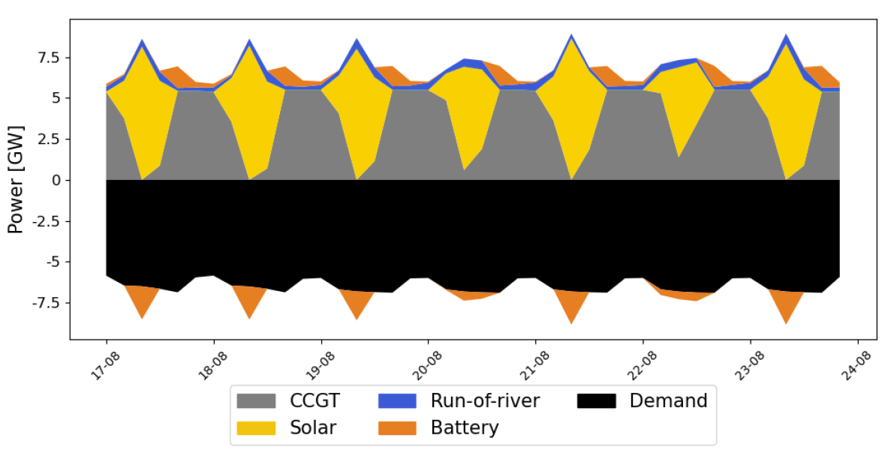
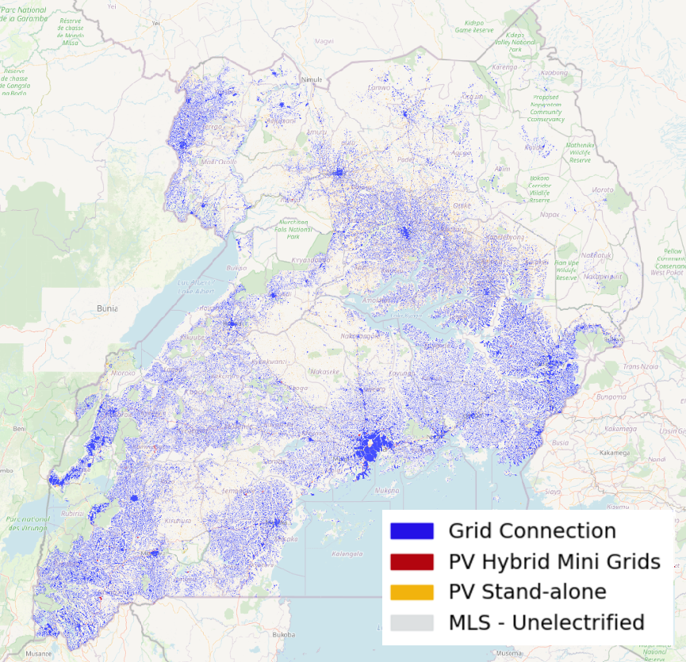

# SPLICE

**Soft-linking framework for integrated energy and electrification planning.**  
Couples [OnSSET](https://github.com/OnSSET) (geospatial electrification) with [PyPSA-Earth](https://github.com/pypsa-meets-earth/pypsa-earth) (power system optimisation) through an iterative cost-of-electricity feedback loop.

[](LICENSE)
[](https://www.python.org/)
[](https://doi.org/10.5281/zenodo.20157076)

---

## Overview

SPLICE (Soft-linking Pipeline for Integrated Energy and Electrification) iteratively couples two established open-source models:

- **OnSSET** — a geospatial electrification planning tool that allocates least-cost technologies (grid extension, mini-grids, stand-alone systems) to unelectrified settlements.
- **PyPSA-Earth** — a power system optimisation model that determines the generation portfolio, storage, and transmission expansion needed to meet national electricity demand at least cost.

Neither model alone accounts for the feedback between electrification choices and power-system costs. SPLICE closes this gap through an iterative exchange: OnSSET produces spatially explicit demand estimates that inform a PyPSA-Earth optimisation, which in turn yields updated nodal costs of electricity (COE) that reshape the electrification masterplan in the next OnSSET run.

<p align="center">
  
  
  
</p>


```
Initialise COE⁽⁰⁾
        │
┌───────▼──────────┐
│    OnSSET        │              ← COE_r  (nodal cost of electricity)
│ Electrification  │
│   masterplan     │
└───────┬──────────┘
        │  L_Y,r  (aggregated nodal peak demand)
┌───────▼────────┐
│  PyPSA-Earth   │
│  Generation    │
│  portfolio  +  │
│  transmission  │
└───────┬────────┘
        │  Updated COE_r
        ▼
  |COE⁽ⁱᵗ⁾ − COE⁽ⁱᵗ⁻¹⁾| < ε ?
        │              │
       NO             YES → Integrated Energy Plan ✓
  (next iteration)
```

The loop terminates when the absolute change in nodal COE between consecutive iterations falls below the convergence threshold ε. In practice, convergence is reached within a small number of iterations.

---

## Repository structure

```
SPLICE/
│
├── master_v2.py                  # Main pipeline: soft-linking loop orchestrator
├── calculateCOE.py               # Extracts nodal COE from PyPSA-Earth results
│
├── onsset/                       # Extended OnSSET package
│   ├── onsset.py                 # Core electrification model
│   ├── footbridge.py             # Coupling layer: demand aggregation & COE injection
│   ├── hybrids.py                # Hybrid mini-grid (solar+battery) modelling
│   ├── hybrids_wind.py           # Hybrid mini-grid (solar+wind+battery) modelling
│   ├── configModifier.py         # Scenario parameter configuration
│   ├── detailed_tech_parameters.py  # Technology cost and performance assumptions
│   ├── build_country_input.py    # Country-level input preparation
│   ├── specs.py                  # Specification definitions
│   ├── runner.py                 # OnSSET run manager
│   ├── main_runner.py            # Entry point for standalone OnSSET runs
│   ├── gui_runner.py             # Optional GUI runner
│   ├── funcs.py                  # Shared utility functions
│   └── __init__.py
│
├── input/                        # Input data — see Input data section below
│
├── output/                       # Generated at runtime — see Output format below
│
├── detailed_tech_parameters.ipynb # Technology parameter exploration notebook
├── funcs.ipynb                    # Utility function development notebook
│
├── CITATION.cff
├── LICENSE
└── README.md
```

---

## Installation

### 1. Clone SPLICE

```bash
git clone https://github.com/CorradoMariaCaminiti/SPLICE.git --recurse-submodules
cd SPLICE
```

The `--recurse-submodules` flag also clones the compatible PyPSA-Earth branch, so no separate cloning is needed.

> SPLICE and PyPSA-Earth should sit **side by side** in the same parent folder.  
> Set the path to your local PyPSA-Earth clone in `master_v2.py` line 13.

### 2. Set up the conda environment

```bash
conda create -n splice python=3.10
conda activate splice
pip install -r requirements.txt
pip install -e ./onsset
```

> PyPSA and linopy are installed as part of PyPSA-Earth — see its  
> [installation guide](https://pypsa-meets-earth.github.io/pypsa-earth/) for solver setup.

### 3. Download input data from Zenodo

```bash
# Download from https://doi.org/10.5281/zenodo.20157076
# and place all files in input/
```

---

## Usage

### Run the full soft-linking pipeline

```bash
python master_v2.py
```

Scenario parameters (electrification tier, demand assumptions, CO₂ constraints) are configured in `onsset/configModifier.py` and the country specs file in `input/`.

### Run OnSSET standalone

```bash
python onsset/main_runner.py
```

### Extract COE from an existing PyPSA-Earth network solution

```bash
python calculateCOE.py
```

### Output format

Each iteration produces three files in `output/`:

| File | Contents |
|---|---|
| `{run}_{it}_Results.csv` | Community-level electrification technology allocation |
| `{run}_{it}_Summaries.csv` | Aggregated metrics per region and technology |
| `{run}_{it}_Variables.csv` | Intermediate variables for diagnostic purposes |

---

## Key modules

**`master_v2.py`** — orchestrates the soft-linking loop: initialises COE, calls OnSSET, aggregates demand, calls PyPSA-Earth, extracts updated COE, and checks the convergence criterion `|COE^(it) − COE^(it−1)| < ε`.

**`calculateCOE.py`** — reads the PyPSA-Earth optimised network and computes the nodal marginal cost of electricity (shadow price of the nodal energy balance constraint) fed back into OnSSET.

**`onsset/footbridge.py`** — the coupling layer. Handles (i) geospatial aggregation of grid-connected residential demand from OnSSET clusters to PyPSA-Earth nodes, and (ii) injection of the updated COE into OnSSET's LCOE comparisons.

**`onsset/hybrids.py` / `hybrids_wind.py`** — extended mini-grid modelling for solar+battery and solar+wind+battery configurations, beyond the standard OnSSET technology set.

**`onsset/configModifier.py`** — programmatic control of scenario parameters, enabling batch runs without manual edits to input files.

---

## Input data

Large geospatial and compressed files (`*.gz`, `*.gpkg`, `*.shp`, `*.csv` > 10 MB) are **not tracked by Git**. They are archived on Zenodo at [https://doi.org/10.5281/zenodo.20157076](https://zenodo.org/records/20157076).

Download and place them in `input/` before running the pipeline.

| File type | Description | Typical source |
|---|---|---|
| OnSSET calibrated input (`.csv`) | Geospatial settlement data with calibrated electrification attributes | [WorldPop](https://www.worldpop.org/), [GADM](https://gadm.org/), national surveys |
| Network and resource data (`.gz`) | Country-level grid topology, renewable resource maps | PyPSA-Earth automated download |
| Country specs (`.xlsx`) | PyPSA-Earth configuration and scenario parameters | This work |
| Industrial demand (`.gpkg`) | Geospatially distributed industrial load | National energy plans, [IEA country reports](https://www.iea.org/) |
| Capacity factor time series (`.csv`) | Solar and wind hourly capacity factors | [renewables.ninja](https://www.renewables.ninja/) via PyPSA-Earth |
| Hydropower data (`.csv`) | Hydropower generation potential and flow data | National grid operator / energy regulator |

---

## Dependencies

| Package | Role |
|---|---|
| [PyPSA-Earth](https://github.com/pypsa-meets-earth/pypsa-earth) | Power system optimisation (run externally via Snakemake) |
| [PyPSA](https://github.com/PyPSA/PyPSA) | Network model underlying PyPSA-Earth |
| [pandas](https://pandas.pydata.org/) | Tabular data handling |
| [geopandas](https://geopandas.org/) | Spatial joins and GIS operations |
| [numpy](https://numpy.org/) | Numerical operations |
| [openpyxl](https://openpyxl.readthedocs.io/) | Reading Excel specs files |

A LP/MILP solver compatible with PyPSA is required (e.g. [HiGHS](https://highs.dev/) — free, or [Gurobi](https://www.gurobi.com/) — commercial).

---

## License

MIT — see [`LICENSE`](LICENSE).  
OnSSET and PyPSA-Earth are independently licensed; consult their repositories before redistribution.

---

## Acknowledgements

Developed at the Department of Energy, Politecnico di Milano, and DESTEC, University of Pisa.
